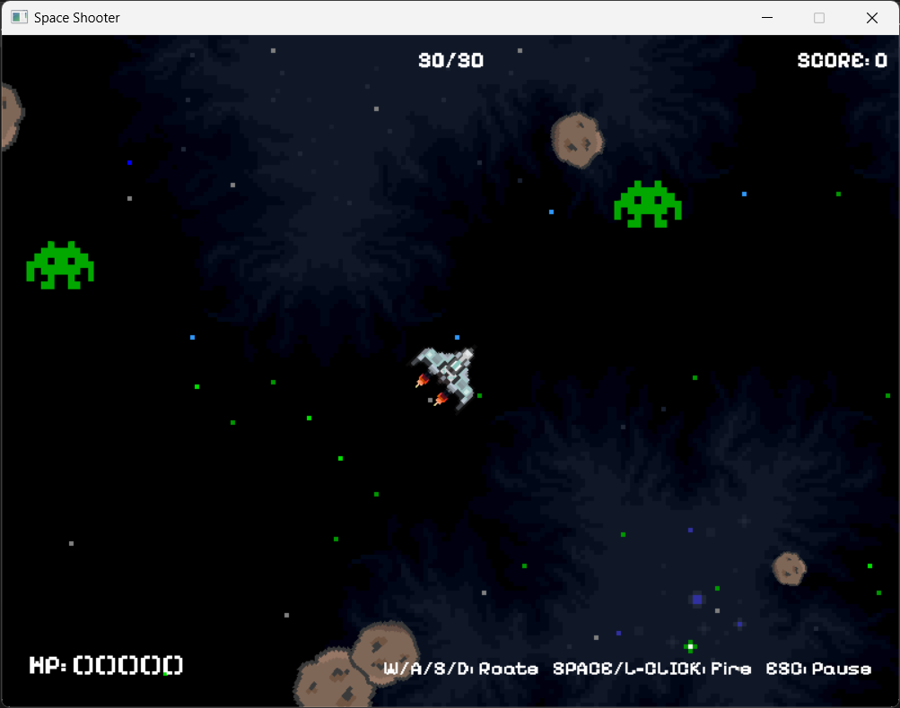

# spaceshooter

SDL2とC++で開発した見下ろし型シューティングゲーム。
開発で力を入れたのは、四分木空間分割を使用した衝突判定処理。

## スクリーンショット

## 操作方法

> ※操作方法は、プレイ画面の右下にも表示。

- W/A/S/D: 移動方向を回転 ※矢印キーでも同様に向きを変更可能。
- SPACE/左クリック: 弾を発射
- ESC: ポーズメニューを表示
